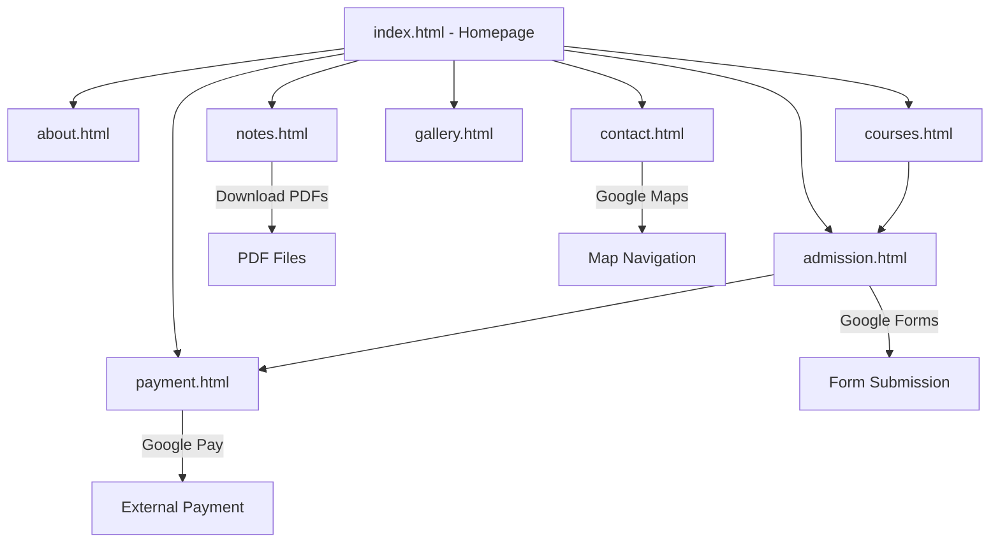

# Design Document: CompuNet Computer Center Website

## Overview

The CompuNet Computer Center website is a professional, modern, static website designed to serve as the primary digital platform for a computer training institute in Rajasthan, India. The website provides information about courses, facilitates online admissions, enables fee payments, and offers downloadable study materials.

### Design Goals

- Create a mobile-first responsive website that works seamlessly across all devices
- Provide an intuitive user experience with smooth navigation and interactions
- Integrate third-party services (Google Forms, Google Pay, Google Maps) for core functionality
- Ensure fast load times and optimal performance
- Maintain a clean, professional aesthetic appropriate for an educational institution
- Enable easy content updates through well-organized file structure

### Technology Choices

**Frontend Framework:** Static HTML5, CSS3, and vanilla JavaScript
- Rationale: No backend required; simple deployment; fast performance; easy maintenance

**CSS Framework:** TailwindCSS (recommended) or Bootstrap 5
- Rationale: Rapid development; built-in responsive utilities; consistent design system; extensive component library

**Icon Library:** FontAwesome
- Rationale: Comprehensive icon set; easy integration; professional appearance

**Typography:** Google Fonts
- Rationale: Free; web-optimized; wide selection; reliable CDN delivery

**Third-Party Integrations:**
- Google Forms (admission form backend)
- Google Pay (payment processing)
- Google Maps (location display)

## Architecture

### System Architecture

The website follows a traditional multi-page application (MPA) architecture with static HTML pages. This design choice provides:

- Simple hosting requirements (static file server)
- Fast initial page loads
- SEO-friendly structure
- No server-side processing needed
- Easy deployment to platforms like GitHub Pages, Netlify, or AWS Amplify

```
┌─────────────────────────────────────────────────────────┐
│                    Browser (Client)                      │
│  ┌────────────┐  ┌────────────┐  ┌────────────┐        │
│  │   HTML5    │  │   CSS3     │  │ JavaScript │        │
│  │   Pages    │  │  Styling   │  │  Behavior  │        │
│  └────────────┘  └────────────┘  └────────────┘        │
└─────────────────────────────────────────────────────────┘
                          │
                          ▼
┌─────────────────────────────────────────────────────────┐
│              Third-Party Services                        │
│  ┌────────────┐  ┌────────────┐  ┌────────────┐        │
│  │   Google   │  │   Google   │  │   Google   │        │
│  │   Forms    │  │    Pay     │  │    Maps    │        │
│  └────────────┘  └────────────┘  └────────────┘        │
└─────────────────────────────────────────────────────────┘
```

### Directory Structure

```
/public
├── index.html              # Homepage
├── about.html              # About page
├── courses.html            # Courses catalog
├── admission.html          # Admission form
├── notes.html              # Study materials
├── gallery.html            # Image gallery
├── payment.html            # Payment interface
├── contact.html            # Contact page
├── /css
│   ├── styles.css          # Main stylesheet
│   └── responsive.css      # Media queries
├── /js
│   ├── main.js             # Core JavaScript
│   ├── navigation.js       # Navigation logic
│   └── animations.js       # UI animations
├── /images
│   ├── /hero               # Hero section images
│   ├── /gallery            # Gallery photos
│   ├── /courses            # Course thumbnails
│   └── /icons              # Custom icons
├── /pdf
│   ├── rscit-notes.pdf     # RS-CIT study material
│   ├── tally-notes.pdf     # Tally accounting notes
│   ├── excel-notes.pdf     # Excel practice notes
│   ├── typing-material.pdf # Typing practice
│   └── basic-computer.pdf  # Basic computer notes
└── /assets
    ├── logo.png            # Institute logo
    ├── qr-code.png         # Google Pay QR code
    └── favicon.ico         # Browser favicon
```

### Page Flow Architecture



## Components and Interfaces

### 1. Navigation System Component

**Purpose:** Provides consistent navigation across all pages with responsive behavior

**Structure:**
```html
<nav class="navbar">
  <div class="logo">CompuNet Computer Center</div>
  <button class="hamburger" aria-label="Toggle menu">☰</button>
  <ul class="nav-links">
    <li><a href="index.html">Home</a></li>
    <li><a href="about.html">About</a></li>
    <li><a href="courses.html">Courses</a></li>
    <li><a href="admission.html">Admission</a></li>
    <li><a href="notes.html">Notes</a></li>
    <li><a href="gallery.html">Gallery</a></li>
    <li><a href="payment.html">Payment</a></li>
    <li><a href="contact.html">Contact</a></li>
  </ul>
</nav>
```

**Behavior:**
- Desktop (≥768px): Horizontal menu bar with all links visible
- Mobile (<768px): Hamburger icon that expands to show menu
- Active page highlighting using CSS class
- Smooth transitions for menu expansion/collapse

**JavaScript Interface:**
```javascript
// navigation.js
class NavigationSystem {
  constructor() {
    this.hamburger = document.querySelector('.hamburger');
    this.navLinks = document.querySelector('.nav-links');
    this.init();
  }
  
  init() {
    this.hamburger.addEventListener('click', () => this.toggleMenu());
    this.highlightActivePage();
  }
  
  toggleMenu() {
    this.navLinks.classList.toggle('active');
  }
  
  highlightActivePage() {
    const currentPage = window.location.pathname.split('/').pop();
    const links = document.querySelectorAll('.nav-links a');
    links.forEach(link => {
      if (link.getAttribute('href') === currentPage) {
        link.classList.add('active');
      }
    });
  }
}
```

### 2. Hero Section Component

**Purpose:** Captures attention and provides primary call-to-action buttons

**Structure:**
```html
<section class="hero">
  <div class="hero-content">
    <h1>CompuNet Computer Center</h1>
    <p class="tagline">Empowering Students with Digital Skills</p>
    <div class="cta-buttons">
      <a href="admission.html" class="btn btn-primary">Join Now</a>
      <a href="courses.html" class="btn btn-secondary">Explore Courses</a>
      <a href="notes.html" class="btn btn-tertiary">Download Notes</a>
    </div>
  </div>
</section>
```

**Styling Considerations:**
- Full viewport height on desktop
- Background image or gradient
- Centered content with responsive typography
- Button hover effects and transitions

### 3. Course Card Component

**Purpose:** Displays individual course information in a consistent format

**Structure:**
```html
<div class="course-card">
  <div class="course-icon">
    <i class="fas fa-laptop-code"></i>
  </div>
  <h3 class="course-title">RS-CIT</h3>
  <p class="course-duration">Duration: 3 Months</p>
  <p class="course-fee">Fee: ₹4200</p>
  <p class="course-description">Government recognized IT literacy course</p>
  <a href="admission.html" class="btn btn-enroll">Enroll Now</a>
</div>
```

**Hover Effects:**
- Scale transform (1.05)
- Box shadow enhancement
- Smooth transition (0.3s)

### 4. Admission Form Component

**Purpose:** Integrates Google Forms for student registration

**Structure:**
```html
<section class="admission-form">
  <h2>Student Admission Form</h2>
  <p class="form-description">
    All student registrations will be securely recorded and stored
  </p>
  <iframe 
    src="[GOOGLE_FORMS_EMBED_URL]"
    width="100%" 
    height="800"
    frameborder="0"
    marginheight="0"
    marginwidth="0">
    Loading…
  </iframe>
</section>
```

**Integration Notes:**
- Google Form must be set to "Allow responses" and "Embed" mode
- Form responses automatically stored in Google Sheets
- Required fields: Name, Phone, Email, Course Interested, Address, Message
- Form validation handled by Google Forms

### 5. Payment Interface Component

**Purpose:** Displays Google Pay payment information and QR code

**Structure:**
```html
<section class="payment-section">
  <h2>Pay Course Fees</h2>
  <p>Students can conveniently pay course fees using Google Pay</p>
  
  <div class="payment-details">
    <div class="upi-info">
      <h3>UPI ID</h3>
      <p class="upi-id">compunetcenter@okaxis</p>
      <button class="btn-copy" onclick="copyUPI()">Copy UPI ID</button>
    </div>
    
    <div class="qr-code">
      <h3>Scan QR Code</h3>
      
    </div>
    
    <div class="payment-instructions">
      <h3>Payment Instructions</h3>
      <ol>
        <li>Open Google Pay app</li>
        <li>Scan the QR code or enter UPI ID</li>
        <li>Enter the course fee amount</li>
        <li>Complete the payment</li>
        <li>Take a screenshot of payment confirmation</li>
      </ol>
    </div>
  </div>
  
  <a href="upi://pay?pa=compunetcenter@okaxis&pn=CompuNet Computer Center" 
     class="btn btn-primary">Pay Now</a>
</section>
```

**JavaScript Interface:**
```javascript
function copyUPI() {
  const upiId = 'compunetcenter@okaxis';
  navigator.clipboard.writeText(upiId).then(() => {
    alert('UPI ID copied to clipboard!');
  });
}
```

### 6. Study Material Download Component

**Purpose:** Provides downloadable PDF study materials

**Structure:**
```html
<section class="study-materials">
  <h2>Download Study Materials</h2>
  
  <div class="material-grid">
    <div class="material-card">
      <i class="fas fa-file-pdf"></i>
      <h3>RS-CIT Notes</h3>
      <p>Complete study material for RS-CIT course</p>
      <a href="pdf/rscit-notes.pdf" download class="btn-download">
        <i class="fas fa-download"></i> Download PDF
      </a>
    </div>
    
    <div class="material-card">
      <i class="fas fa-file-pdf"></i>
      <h3>Tally Accounting Notes</h3>
      <p>Comprehensive Tally software guide</p>
      <a href="pdf/tally-notes.pdf" download class="btn-download">
        <i class="fas fa-download"></i> Download PDF
      </a>
    </div>
    
    <!-- Additional material cards... -->
  </div>
</section>
```

**Download Behavior:**
- Uses HTML5 `download` attribute
- PDFs stored in `/pdf` directory
- Click triggers immediate download
- No server-side processing required

### 7. Gallery Component

**Purpose:** Displays institute photos with hover effects

**Structure:**
```html
<section class="gallery">
  <h2>Our Institute Gallery</h2>
  
  <div class="gallery-grid">
    <div class="gallery-item">
      
      <div class="gallery-overlay">
        <h3>Computer Lab</h3>
      </div>
    </div>
    
    <div class="gallery-item">
      
      <div class="gallery-overlay">
        <h3>Students Training</h3>
      </div>
    </div>
    
    <!-- Additional gallery items... -->
  </div>
</section>
```

**CSS Effects:**
```css
.gallery-item {
  position: relative;
  overflow: hidden;
  transition: transform 0.3s ease;
}

.gallery-item:hover {
  transform: scale(1.05);
}

.gallery-item:hover .gallery-overlay {
  opacity: 1;
}

.gallery-overlay {
  position: absolute;
  top: 0;
  left: 0;
  width: 100%;
  height: 100%;
  background: rgba(0, 0, 0, 0.7);
  opacity: 0;
  transition: opacity 0.3s ease;
  display: flex;
  align-items: center;
  justify-content: center;
  color: white;
}
```

### 8. Contact Module Component

**Purpose:** Displays contact information and Google Maps integration

**Structure:**
```html
<section class="contact-section">
  <h2>Contact Us</h2>
  
  <div class="contact-grid">
    <div class="contact-info">
      <div class="contact-person">
        <h3>Director</h3>
        <p class="name">Suresh Joshi</p>
        <a href="tel:9829293303" class="btn-call">
          <i class="fas fa-phone"></i> 9829293303
        </a>
      </div>
      
      <div class="contact-person">
        <h3>Faculty</h3>
        <p class="name">Gayatri Joshi</p>
        <a href="tel:9829621004" class="btn-call">
          <i class="fas fa-phone"></i> 9829621004
        </a>
      </div>
      
      <div class="contact-methods">
        <a href="https://wa.me/919829293303" class="btn-whatsapp">
          <i class="fab fa-whatsapp"></i> WhatsApp
        </a>
      </div>
    </div>
    
    <div class="map-container">
      <iframe 
        src="[GOOGLE_MAPS_EMBED_URL]"
        width="100%" 
        height="400"
        style="border:0;" 
        allowfullscreen="" 
        loading="lazy">
      </iframe>
      <a href="[GOOGLE_MAPS_DIRECT_URL]" 
         target="_blank" 
         class="btn-map">
        Open in Google Maps
      </a>
    </div>
  </div>
</section>
```

### 9. Footer Component

**Purpose:** Provides site-wide footer with links and information

**Structure:**
```html
<footer class="footer">
  <div class="footer-grid">
    <div class="footer-section">
      <h3>About Institute</h3>
      <p>Professional computer training institute providing quality education...</p>
    </div>
    
    <div class="footer-section">
      <h3>Quick Links</h3>
      <ul>
        <li><a href="index.html">Home</a></li>
        <li><a href="about.html">About</a></li>
        <li><a href="courses.html">Courses</a></li>
        <li><a href="admission.html">Admission</a></li>
      </ul>
    </div>
    
    <div class="footer-section">
      <h3>Course List</h3>
      <ul>
        <li>RS-CIT</li>
        <li>RS-CFA (Tally)</li>
        <li>Spoken English</li>
        <li>MS Office</li>
      </ul>
    </div>
    
    <div class="footer-section">
      <h3>Contact</h3>
      <p>Director: 9829293303</p>
      <p>Faculty: 9829621004</p>
      <div class="social-icons">
        <a href="#"><i class="fab fa-facebook"></i></a>
        <a href="#"><i class="fab fa-instagram"></i></a>
        <a href="#"><i class="fab fa-youtube"></i></a>
      </div>
    </div>
  </div>
  
  <div class="footer-bottom">
    <p>© 2026 CompuNet Computer Center. All rights reserved.</p>
  </div>
</footer>
```

### 10. Enhanced UX Features

**Scroll-to-Top Button:**
```html
<button id="scrollTopBtn" class="scroll-top-btn" aria-label="Scroll to top">
  <i class="fas fa-arrow-up"></i>
</button>
```

```javascript
// Show/hide scroll-to-top button
window.addEventListener('scroll', () => {
  const scrollTopBtn = document.getElementById('scrollTopBtn');
  if (window.pageYOffset > 300) {
    scrollTopBtn.classList.add('visible');
  } else {
    scrollTopBtn.classList.remove('visible');
  }
});

// Smooth scroll to top
document.getElementById('scrollTopBtn').addEventListener('click', () => {
  window.scrollTo({
    top: 0,
    behavior: 'smooth'
  });
});
```

**Floating WhatsApp Button:**
```html
<a href="https://wa.me/919829293303" 
   class="whatsapp-float" 
   target="_blank"
   aria-label="Contact on WhatsApp">
  <i class="fab fa-whatsapp"></i>
</a>
```

```css
.whatsapp-float {
  position: fixed;
  bottom: 20px;
  right: 20px;
  width: 60px;
  height: 60px;
  background-color: #25D366;
  color: white;
  border-radius: 50%;
  display: flex;
  align-items: center;
  justify-content: center;
  font-size: 30px;
  box-shadow: 0 4px 8px rgba(0,0,0,0.3);
  z-index: 1000;
  transition: transform 0.3s ease;
}

.whatsapp-float:hover {
  transform: scale(1.1);
}
```

## Data Models

### Course Data Structure

Since this is a static website, course data can be represented as JavaScript objects or JSON for easy maintenance:

```javascript
const courses = [
  {
    id: 'rscit',
    title: 'RS-CIT',
    duration: '3 Months',
    fee: 4200,
    currency: '₹',
    description: 'Government recognized IT literacy course',
    icon: 'fa-laptop-code',
    featured: true,
    topics: [
      'Computer Fundamentals',
      'Windows Operating System',
      'MS Office Suite',
      'Internet & Email',
      'Digital Payment Systems'
    ]
  },
  {
    id: 'rscfa',
    title: 'RS-CFA',
    duration: '3 Months',
    fee: 7000,
    currency: '₹',
    description: 'Financial accounting with Tally software',
    icon: 'fa-calculator',
    featured: true,
    topics: [
      'Accounting Fundamentals',
      'Tally Prime',
      'GST Accounting',
      'Inventory Management',
      'Financial Reports'
    ]
  },
  {
    id: 'spoken-english',
    title: 'Spoken English & Personality Development',
    duration: '3 Months',
    fee: 6000,
    currency: '₹',
    description: 'Communication skills, confidence, interview prep',
    icon: 'fa-comments',
    featured: true,
    topics: [
      'Grammar Basics',
      'Conversation Practice',
      'Public Speaking',
      'Interview Skills',
      'Personality Development'
    ]
  },
  {
    id: 'ms-office',
    title: 'Advanced Microsoft Office',
    duration: '3 Months',
    fee: 10000,
    currency: '₹',
    description: 'Word, Excel, PowerPoint, Access, Outlook',
    icon: 'fa-file-word',
    featured: true,
    topics: [
      'MS Word Advanced',
      'MS Excel with Formulas',
      'PowerPoint Presentations',
      'MS Access Database',
      'Outlook Email Management'
    ]
  },
  {
    id: 'digital-marketing',
    title: 'Digital Marketing',
    duration: '3 Months',
    fee: 8000,
    currency: '₹',
    description: 'SEO, Social Media, Content Marketing',
    icon: 'fa-bullhorn',
    featured: false
  },
  {
    id: 'graphic-design',
    title: 'Graphic Design',
    duration: '3 Months',
    fee: 9000,
    currency: '₹',
    description: 'Photoshop, Illustrator, CorelDRAW',
    icon: 'fa-palette',
    featured: false
  },
  {
    id: 'web-development',
    title: 'Web Development',
    duration: '6 Months',
    fee: 15000,
    currency: '₹',
    description: 'HTML, CSS, JavaScript, Responsive Design',
    icon: 'fa-code',
    featured: false
  },
  {
    id: 'basic-computer',
    title: 'Basic Computer Course',
    duration: '2 Months',
    fee: 3000,
    currency: '₹',
    description: 'Computer basics for beginners',
    icon: 'fa-desktop',
    featured: false
  },
  {
    id: 'dtp',
    title: 'Desktop Publishing',
    duration: '2 Months',
    fee: 5000,
    currency: '₹',
    description: 'PageMaker, InDesign, Publishing',
    icon: 'fa-book',
    featured: false
  },
  {
    id: 'hindi-typing',
    title: 'Hindi Typing',
    duration: '1 Month',
    fee: 2000,
    currency: '₹',
    description: 'Hindi typing speed and accuracy',
    icon: 'fa-keyboard',
    featured: false
  },
  {
    id: 'english-typing',
    title: 'English Typing',
    duration: '1 Month',
    fee: 2000,
    currency: '₹',
    description: 'English typing speed and accuracy',
    icon: 'fa-keyboard',
    featured: false
  }
];
```

### Study Material Data Structure

```javascript
const studyMaterials = [
  {
    id: 'rscit-notes',
    title: 'RS-CIT Notes',
    description: 'Complete study material for RS-CIT course',
    filename: 'rscit-notes.pdf',
    category: 'Government Courses',
    size: '2.5 MB',
    icon: 'fa-file-pdf'
  },
  {
    id: 'tally-notes',
    title: 'Tally Accounting Notes',
    description: 'Comprehensive Tally software guide',
    filename: 'tally-notes.pdf',
    category: 'Accounting',
    size: '3.1 MB',
    icon: 'fa-file-pdf'
  },
  {
    id: 'excel-notes',
    title: 'Excel Practice Notes',
    description: 'Excel formulas and practice exercises',
    filename: 'excel-notes.pdf',
    category: 'MS Office',
    size: '1.8 MB',
    icon: 'fa-file-pdf'
  },
  {
    id: 'typing-material',
    title: 'Typing Practice Material',
    description: 'Hindi and English typing practice',
    filename: 'typing-material.pdf',
    category: 'Typing',
    size: '1.2 MB',
    icon: 'fa-file-pdf'
  },
  {
    id: 'basic-computer',
    title: 'Basic Computer Notes',
    description: 'Computer fundamentals for beginners',
    filename: 'basic-computer.pdf',
    category: 'Basics',
    size: '2.0 MB',
    icon: 'fa-file-pdf'
  }
];
```

### Gallery Image Data Structure

```javascript
const galleryImages = [
  {
    id: 'computer-lab',
    title: 'Computer Lab',
    filename: 'computer-lab.jpg',
    alt: 'Modern computer lab with latest systems',
    category: 'Facilities'
  },
  {
    id: 'students-training',
    title: 'Students Training',
    filename: 'students-training.jpg',
    alt: 'Students learning in classroom',
    category: 'Activities'
  },
  {
    id: 'typing-practice',
    title: 'Typing Practice',
    filename: 'typing-practice.jpg',
    alt: 'Students practicing typing skills',
    category: 'Activities'
  },
  {
    id: 'classroom',
    title: 'Institute Classroom',
    filename: 'classroom.jpg',
    alt: 'Well-equipped classroom environment',
    category: 'Facilities'
  },
  {
    id: 'certificates',
    title: 'Certificates',
    filename: 'certificates.jpg',
    alt: 'Course completion certificates',
    category: 'Achievements'
  },
  {
    id: 'student-activities',
    title: 'Student Activities',
    filename: 'student-activities.jpg',
    alt: 'Students participating in activities',
    category: 'Activities'
  }
];
```

### Contact Information Data Structure

```javascript
const contactInfo = {
  institute: {
    name: 'CompuNet Computer Center',
    address: '[To be provided by user]',
    city: 'Rajasthan',
    country: 'India'
  },
  contacts: [
    {
      role: 'Director',
      name: 'Suresh Joshi',
      phone: '9829293303',
      phoneLink: 'tel:9829293303',
      whatsapp: 'https://wa.me/919829293303'
    },
    {
      role: 'Faculty',
      name: 'Gayatri Joshi',
      phone: '9829621004',
      phoneLink: 'tel:9829621004',
      whatsapp: 'https://wa.me/919829621004'
    }
  ],
  payment: {
    upiId: 'compunetcenter@okaxis',
    qrCodeImage: 'assets/qr-code.png',
    upiLink: 'upi://pay?pa=compunetcenter@okaxis&pn=CompuNet Computer Center'
  },
  social: {
    facebook: '#',
    instagram: '#',
    youtube: '#'
  },
  maps: {
    embedUrl: '[To be provided by user]',
    directUrl: '[To be provided by user]'
  }
};
```

### Page Metadata Structure

For SEO optimization, each page should have structured metadata:

```javascript
const pageMetadata = {
  'index.html': {
    title: 'CompuNet Computer Center - Computer Training Institute in Rajasthan',
    description: 'Professional computer training institute offering RS-CIT, Tally, MS Office, Spoken English, and more. Quality education with government certified programs.',
    keywords: 'computer training, RS-CIT, Tally course, computer institute Rajasthan, IT training',
    ogImage: 'assets/og-image.jpg'
  },
  'courses.html': {
    title: 'Courses - CompuNet Computer Center',
    description: 'Explore our comprehensive computer courses including RS-CIT, RS-CFA, Spoken English, MS Office, Digital Marketing, and Web Development.',
    keywords: 'computer courses, RS-CIT course, Tally training, MS Office course, web development',
    ogImage: 'assets/courses-og.jpg'
  },
  'admission.html': {
    title: 'Admission - CompuNet Computer Center',
    description: 'Apply online for admission to CompuNet Computer Center. Easy online registration for all computer courses.',
    keywords: 'computer course admission, online registration, enroll computer training',
    ogImage: 'assets/admission-og.jpg'
  }
  // Additional pages...
};
```

### Responsive Breakpoints

```javascript
const breakpoints = {
  mobile: '0px',      // 0-767px
  tablet: '768px',    // 768-1023px
  desktop: '1024px',  // 1024-1439px
  wide: '1440px'      // 1440px+
};
```


## Correctness Properties

*A property is a characteristic or behavior that should hold true across all valid executions of a system—essentially, a formal statement about what the system should do. Properties serve as the bridge between human-readable specifications and machine-verifiable correctness guarantees.*

### Property 1: Navigation Consistency Across Pages

*For any* HTML page in the website, the navigation system should include links to all eight pages: Home, About, Courses, Admission, Notes, Gallery, Payment, and Contact.

**Validates: Requirements 12.1, 12.2**

### Property 2: Active Page Highlighting

*For any* HTML page in the website, the navigation link corresponding to the current page should have an active state (CSS class or styling) to indicate the user's current location.

**Validates: Requirements 12.3**

### Property 3: Download Button Functionality

*For any* download button in the study materials section, clicking the button should have an href attribute pointing to a PDF file and include the download attribute to trigger file download.

**Validates: Requirements 8.2**

### Property 4: SEO Meta Tags Presence

*For any* HTML page in the website, the head section should include essential SEO meta tags: title, description, and viewport.

**Validates: Requirements 14.6**

### Property 5: Semantic HTML Usage

*For any* HTML page in the website, the page structure should use semantic HTML5 elements (header, nav, main, section, article, footer) rather than generic div elements for major structural components.

**Validates: Requirements 16.1**

### Property 6: Image Alt Text Completeness

*For any* img element in the website, the element should include an alt attribute with descriptive text for accessibility.

**Validates: Requirements 16.2**


## Error Handling

### Client-Side Error Scenarios

**1. Missing External Resources**

*Scenario:* CDN resources (Bootstrap, FontAwesome, Google Fonts) fail to load

*Handling Strategy:*
- Include fallback local copies of critical CSS frameworks
- Use font-display: swap for Google Fonts to prevent invisible text
- Implement resource loading checks in JavaScript

```javascript
// Check if Bootstrap loaded, fallback to local
if (typeof bootstrap === 'undefined') {
  const link = document.createElement('link');
  link.rel = 'stylesheet';
  link.href = 'css/bootstrap.min.css';
  document.head.appendChild(link);
}
```

**2. Google Forms Iframe Loading Failure**

*Scenario:* Google Forms iframe fails to load or is blocked

*Handling Strategy:*
- Display fallback contact information
- Provide alternative contact methods (phone, WhatsApp, email)
- Show user-friendly error message

```javascript
const iframe = document.querySelector('iframe[src*="google.com/forms"]');
iframe.addEventListener('error', () => {
  iframe.parentElement.innerHTML = `
    <div class="fallback-message">
      <p>Unable to load the admission form. Please contact us directly:</p>
      <p>Phone: 9829293303 | WhatsApp: 9829293303</p>
    </div>
  `;
});
```

**3. PDF Download Failures**

*Scenario:* PDF file is missing or download fails

*Handling Strategy:*
- Verify PDF files exist before deployment
- Implement download error handling
- Provide alternative access methods

```javascript
function handleDownload(pdfUrl, filename) {
  fetch(pdfUrl, { method: 'HEAD' })
    .then(response => {
      if (response.ok) {
        window.location.href = pdfUrl;
      } else {
        alert('PDF not available. Please contact us for study materials.');
      }
    })
    .catch(() => {
      alert('Download failed. Please try again or contact us.');
    });
}
```

**4. Google Maps Embed Failure**

*Scenario:* Google Maps iframe fails to load

*Handling Strategy:*
- Display static address information
- Provide "Open in Google Maps" link as primary option
- Show fallback contact information

**5. Payment Link Errors**

*Scenario:* UPI payment link doesn't open payment app

*Handling Strategy:*
- Provide multiple payment options (QR code, UPI ID copy)
- Display clear manual payment instructions
- Include contact information for payment assistance

```javascript
function initiatePayment() {
  const upiLink = 'upi://pay?pa=compunetcenter@okaxis&pn=CompuNet Computer Center';
  
  // Try to open UPI app
  window.location.href = upiLink;
  
  // Show fallback after delay
  setTimeout(() => {
    alert('If payment app did not open, please scan the QR code or copy the UPI ID manually.');
  }, 2000);
}
```

### Browser Compatibility Issues

**Older Browser Support:**
- Provide graceful degradation for CSS Grid (fallback to Flexbox)
- Include polyfills for modern JavaScript features if supporting IE11
- Test on major browsers: Chrome, Firefox, Safari, Edge

```javascript
// Feature detection for CSS Grid
if (!CSS.supports('display', 'grid')) {
  document.body.classList.add('no-grid');
  // Fallback styles applied via .no-grid class
}
```

### Mobile-Specific Error Handling

**Touch Event Failures:**
- Ensure all interactive elements have sufficient touch targets (44x44px minimum)
- Provide visual feedback for touch interactions
- Handle orientation changes gracefully

**Network Connectivity Issues:**
- Optimize for slow connections with image lazy loading
- Minimize external dependencies
- Provide offline-friendly error messages

### Form Validation Errors

Since the admission form uses Google Forms, validation is handled by Google. However, we should:
- Clearly mark required fields in the form description
- Provide field format examples (phone number format, email format)
- Display helpful error messages from Google Forms

### JavaScript Disabled Scenario

*Handling Strategy:*
- Ensure core content is accessible without JavaScript
- Navigation links work as standard HTML links
- Forms submit using standard HTML form submission
- Add noscript tags with important messages

```html
<noscript>
  <div class="noscript-warning">
    For the best experience, please enable JavaScript in your browser.
    Basic functionality will still work without it.
  </div>
</noscript>
```


## Testing Strategy

### Overview

The CompuNet Computer Center website testing strategy employs a dual approach combining traditional unit testing for specific examples and edge cases with property-based testing for universal behaviors. This ensures comprehensive coverage of both concrete scenarios and general correctness properties.

### Testing Approach

**Unit Tests:** Verify specific examples, edge cases, and integration points
**Property Tests:** Verify universal properties across all inputs and pages

Both testing approaches are complementary and necessary for comprehensive coverage. Unit tests catch concrete bugs in specific scenarios, while property tests verify general correctness across many variations.

### Property-Based Testing

**Library Selection:** For JavaScript/Node.js testing, we will use **fast-check** as our property-based testing library.

**Configuration:**
- Minimum 100 iterations per property test (due to randomization)
- Each property test references its design document property
- Tag format: **Feature: compunet-computer-center-website, Property {number}: {property_text}**

**Property Test Examples:**

```javascript
// Property 1: Navigation Consistency Across Pages
// Feature: compunet-computer-center-website, Property 1: Navigation Consistency Across Pages
describe('Navigation System Properties', () => {
  const pages = [
    'index.html', 'about.html', 'courses.html', 'admission.html',
    'notes.html', 'gallery.html', 'payment.html', 'contact.html'
  ];
  
  const expectedLinks = [
    { text: 'Home', href: 'index.html' },
    { text: 'About', href: 'about.html' },
    { text: 'Courses', href: 'courses.html' },
    { text: 'Admission', href: 'admission.html' },
    { text: 'Notes', href: 'notes.html' },
    { text: 'Gallery', href: 'gallery.html' },
    { text: 'Payment', href: 'payment.html' },
    { text: 'Contact', href: 'contact.html' }
  ];
  
  test('all pages have complete navigation', () => {
    fc.assert(
      fc.property(
        fc.constantFrom(...pages),
        (pagePath) => {
          const html = fs.readFileSync(`public/${pagePath}`, 'utf-8');
          const $ = cheerio.load(html);
          const navLinks = $('nav a');
          
          // Check all expected links are present
          return expectedLinks.every(expected => {
            return navLinks.toArray().some(link => {
              const href = $(link).attr('href');
              return href === expected.href || href.endsWith(expected.href);
            });
          });
        }
      ),
      { numRuns: 100 }
    );
  });
});

// Property 2: Active Page Highlighting
// Feature: compunet-computer-center-website, Property 2: Active Page Highlighting
test('current page is highlighted in navigation', () => {
  fc.assert(
    fc.property(
      fc.constantFrom(...pages),
      (pagePath) => {
        const html = fs.readFileSync(`public/${pagePath}`, 'utf-8');
        const $ = cheerio.load(html);
        
        // Find the nav link that matches current page
        const activeLink = $(`nav a[href="${pagePath}"], nav a[href="./${pagePath}"]`);
        
        // Should have active class or active styling
        return activeLink.hasClass('active') || 
               activeLink.parent().hasClass('active') ||
               activeLink.attr('aria-current') === 'page';
      }
    ),
    { numRuns: 100 }
  );
});

// Property 3: Download Button Functionality
// Feature: compunet-computer-center-website, Property 3: Download Button Functionality
test('all download buttons have correct attributes', () => {
  const html = fs.readFileSync('public/notes.html', 'utf-8');
  const $ = cheerio.load(html);
  const downloadButtons = $('a[download], .btn-download');
  
  fc.assert(
    fc.property(
      fc.integer({ min: 0, max: downloadButtons.length - 1 }),
      (index) => {
        const button = downloadButtons.eq(index);
        const href = button.attr('href');
        const hasDownload = button.attr('download') !== undefined;
        
        // Should point to PDF and have download attribute
        return href && href.endsWith('.pdf') && hasDownload;
      }
    ),
    { numRuns: 100 }
  );
});

// Property 4: SEO Meta Tags Presence
// Feature: compunet-computer-center-website, Property 4: SEO Meta Tags Presence
test('all pages have essential SEO meta tags', () => {
  fc.assert(
    fc.property(
      fc.constantFrom(...pages),
      (pagePath) => {
        const html = fs.readFileSync(`public/${pagePath}`, 'utf-8');
        const $ = cheerio.load(html);
        
        const hasTitle = $('head title').length > 0;
        const hasDescription = $('head meta[name="description"]').length > 0;
        const hasViewport = $('head meta[name="viewport"]').length > 0;
        
        return hasTitle && hasDescription && hasViewport;
      }
    ),
    { numRuns: 100 }
  );
});

// Property 5: Semantic HTML Usage
// Feature: compunet-computer-center-website, Property 5: Semantic HTML Usage
test('all pages use semantic HTML5 elements', () => {
  fc.assert(
    fc.property(
      fc.constantFrom(...pages),
      (pagePath) => {
        const html = fs.readFileSync(`public/${pagePath}`, 'utf-8');
        const $ = cheerio.load(html);
        
        // Check for presence of semantic elements
        const hasHeader = $('header').length > 0;
        const hasNav = $('nav').length > 0;
        const hasMain = $('main').length > 0;
        const hasFooter = $('footer').length > 0;
        
        // At least 3 of 4 semantic elements should be present
        const semanticCount = [hasHeader, hasNav, hasMain, hasFooter]
          .filter(Boolean).length;
        
        return semanticCount >= 3;
      }
    ),
    { numRuns: 100 }
  );
});

// Property 6: Image Alt Text Completeness
// Feature: compunet-computer-center-website, Property 6: Image Alt Text Completeness
test('all images have alt text', () => {
  fc.assert(
    fc.property(
      fc.constantFrom(...pages),
      (pagePath) => {
        const html = fs.readFileSync(`public/${pagePath}`, 'utf-8');
        const $ = cheerio.load(html);
        const images = $('img');
        
        // Every image should have alt attribute
        return images.toArray().every(img => {
          const alt = $(img).attr('alt');
          return alt !== undefined;
        });
      }
    ),
    { numRuns: 100 }
  );
});
```

### Unit Testing

Unit tests focus on specific examples, edge cases, and integration points that don't require property-based testing.

**Test Categories:**

**1. Content Verification Tests**
- Verify specific text content exists on pages
- Check specific course information is displayed correctly
- Validate contact information accuracy

```javascript
describe('Homepage Content', () => {
  test('hero section displays correct title', () => {
    const html = fs.readFileSync('public/index.html', 'utf-8');
    const $ = cheerio.load(html);
    const title = $('.hero h1').text();
    expect(title).toBe('CompuNet Computer Center');
  });
  
  test('hero section displays correct tagline', () => {
    const html = fs.readFileSync('public/index.html', 'utf-8');
    const $ = cheerio.load(html);
    const tagline = $('.hero .tagline').text();
    expect(tagline).toBe('Empowering Students with Digital Skills');
  });
  
  test('hero section has three CTA buttons', () => {
    const html = fs.readFileSync('public/index.html', 'utf-8');
    const $ = cheerio.load(html);
    const buttons = $('.hero .cta-buttons a');
    expect(buttons.length).toBe(3);
  });
});

describe('Course Catalog', () => {
  test('RS-CIT course displays correct information', () => {
    const html = fs.readFileSync('public/courses.html', 'utf-8');
    const $ = cheerio.load(html);
    const rscitCard = $('.course-card:contains("RS-CIT")');
    
    expect(rscitCard.find('.course-duration').text()).toContain('3 Months');
    expect(rscitCard.find('.course-fee').text()).toContain('₹4200');
    expect(rscitCard.find('.course-description').text())
      .toContain('Government recognized IT literacy course');
  });
});

describe('Contact Information', () => {
  test('director contact information is correct', () => {
    const html = fs.readFileSync('public/contact.html', 'utf-8');
    const $ = cheerio.load(html);
    
    expect($('.contact-person:contains("Director")').text()).toContain('Suresh Joshi');
    expect($('a[href="tel:9829293303"]').length).toBeGreaterThan(0);
  });
});
```

**2. Responsive Design Tests**
- Test hamburger menu visibility at mobile breakpoint
- Verify horizontal menu at desktop breakpoint

```javascript
describe('Responsive Navigation', () => {
  test('hamburger menu visible on mobile viewport', () => {
    const html = fs.readFileSync('public/index.html', 'utf-8');
    const $ = cheerio.load(html);
    const hamburger = $('.hamburger');
    
    expect(hamburger.length).toBe(1);
    // CSS test would verify display property at <768px
  });
});
```

**3. Integration Tests**
- Google Forms iframe integration
- Google Maps embed integration
- External link functionality

```javascript
describe('Third-Party Integrations', () => {
  test('admission form has Google Forms iframe', () => {
    const html = fs.readFileSync('public/admission.html', 'utf-8');
    const $ = cheerio.load(html);
    const iframe = $('iframe[src*="google.com/forms"]');
    
    expect(iframe.length).toBe(1);
  });
  
  test('contact page has Google Maps embed', () => {
    const html = fs.readFileSync('public/contact.html', 'utf-8');
    const $ = cheerio.load(html);
    const mapIframe = $('iframe[src*="google.com/maps"]');
    
    expect(mapIframe.length).toBeGreaterThan(0);
  });
  
  test('payment page has UPI payment link', () => {
    const html = fs.readFileSync('public/payment.html', 'utf-8');
    const $ = cheerio.load(html);
    const upiLink = $('a[href^="upi://"]');
    
    expect(upiLink.length).toBeGreaterThan(0);
    expect(upiLink.attr('href')).toContain('compunetcenter@okaxis');
  });
});
```

**4. JavaScript Functionality Tests**
- Scroll-to-top button behavior
- Hamburger menu toggle
- UPI ID copy functionality

```javascript
describe('JavaScript Interactions', () => {
  test('scroll-to-top button appears after scrolling', () => {
    // Mock window.pageYOffset
    Object.defineProperty(window, 'pageYOffset', {
      writable: true,
      value: 400
    });
    
    // Trigger scroll event
    window.dispatchEvent(new Event('scroll'));
    
    const scrollBtn = document.getElementById('scrollTopBtn');
    expect(scrollBtn.classList.contains('visible')).toBe(true);
  });
  
  test('hamburger menu toggles navigation', () => {
    const hamburger = document.querySelector('.hamburger');
    const navLinks = document.querySelector('.nav-links');
    
    hamburger.click();
    expect(navLinks.classList.contains('active')).toBe(true);
    
    hamburger.click();
    expect(navLinks.classList.contains('active')).toBe(false);
  });
});
```

**5. Accessibility Tests**
- Keyboard navigation support
- ARIA labels on interactive elements
- Color contrast (using automated tools)

```javascript
describe('Accessibility', () => {
  test('interactive elements have ARIA labels', () => {
    const html = fs.readFileSync('public/index.html', 'utf-8');
    const $ = cheerio.load(html);
    
    const hamburger = $('.hamburger');
    expect(hamburger.attr('aria-label')).toBeDefined();
    
    const scrollBtn = $('#scrollTopBtn');
    expect(scrollBtn.attr('aria-label')).toBeDefined();
  });
  
  test('form inputs have associated labels', () => {
    // This would be tested if we had custom forms
    // Google Forms handles this internally
  });
});
```

### Visual Regression Testing

For UI consistency, consider using visual regression testing tools:
- **Percy** or **Chromatic** for automated visual testing
- Capture screenshots at different breakpoints
- Compare against baseline images

### Performance Testing

**Metrics to Monitor:**
- Page load time (target: <3 seconds)
- First Contentful Paint (target: <1.5 seconds)
- Largest Contentful Paint (target: <2.5 seconds)
- Cumulative Layout Shift (target: <0.1)

**Tools:**
- Lighthouse CI for automated performance testing
- WebPageTest for detailed performance analysis
- Chrome DevTools for local testing

### Cross-Browser Testing

**Target Browsers:**
- Chrome (latest 2 versions)
- Firefox (latest 2 versions)
- Safari (latest 2 versions)
- Edge (latest 2 versions)
- Mobile Safari (iOS)
- Chrome Mobile (Android)

**Testing Tools:**
- BrowserStack or Sauce Labs for cross-browser testing
- Manual testing on physical devices for mobile

### Deployment Verification

**Pre-Deployment Checklist:**
- All HTML files present in /public folder
- All assets (images, PDFs, CSS, JS) properly linked
- External CDN links functional
- Google Forms URL configured
- Google Maps URL configured
- Google Pay QR code image present
- All internal links working
- No console errors
- Mobile responsiveness verified

**Post-Deployment Testing:**
- Verify all pages load correctly
- Test all navigation links
- Test download functionality
- Test payment link on mobile device
- Verify Google Forms submission
- Check Google Maps functionality
- Test WhatsApp button on mobile

### Continuous Integration

**CI Pipeline Steps:**
1. Run unit tests
2. Run property-based tests
3. Run accessibility tests
4. Run Lighthouse performance audit
5. Build and optimize assets
6. Deploy to staging environment
7. Run smoke tests on staging
8. Deploy to production (if all tests pass)

### Test Coverage Goals

- **Unit Test Coverage:** 80%+ for JavaScript files
- **Property Test Coverage:** 100% of defined properties
- **Page Coverage:** 100% of HTML pages tested
- **Accessibility Coverage:** WCAG 2.1 Level AA compliance

